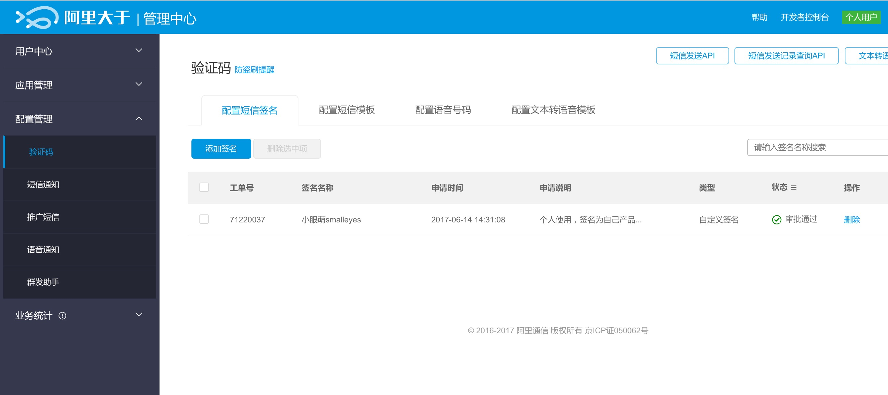
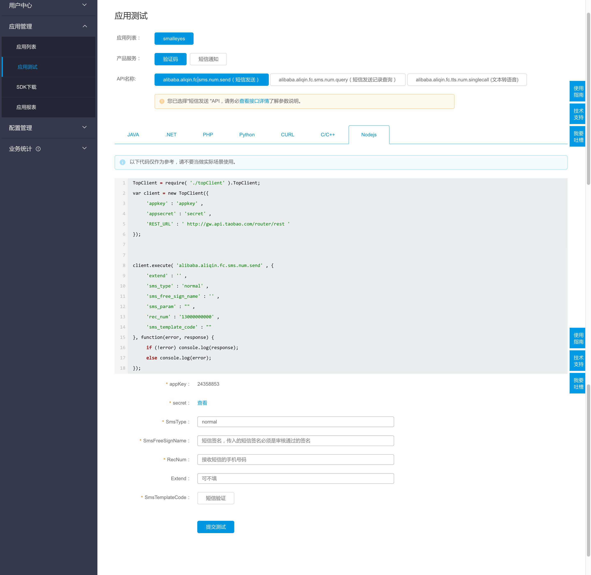
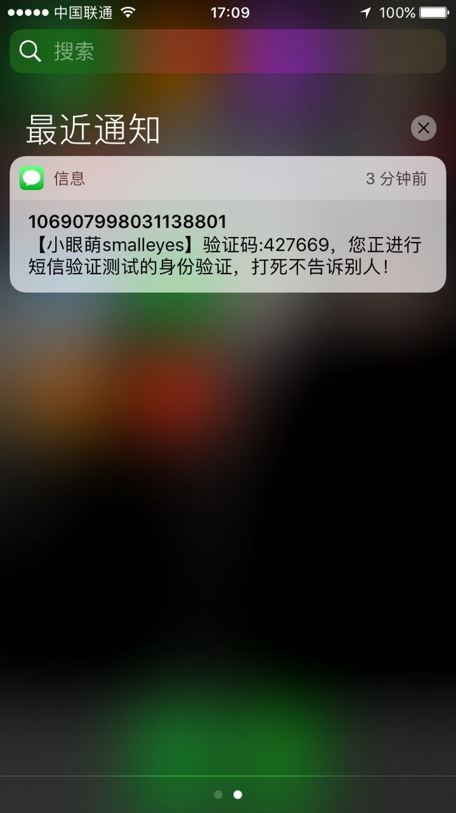

# nodejs 实现发送手机验证码功能
# 阿里大于已于7月份关闭相关端口，对应业务转移到阿里云短信服务平台
nodejs实现手机验证码发送功能,借助阿里大于短信发送平台，实现手机短信发送功能，可用于网站注册等

## 下载项目
```
git clone https://github.com/zhaoxuhui1122/verificationCode.git
```
## 初始化
```
npm install
```

# 配置说明
### 1.config/alidayu.js
该文件为阿里大于实现手机短信服务的配置文件，可使用官方的SDK，该文件不需要做任何更改
### 2.service/phone.js
```javascript
const Alidayu = require('../config/alidayu');
const randomCode = require("./config/randomCode");
const config = {
	app_key: 'your app key', //自己申请的appkey
	secret: 'your secret' //对应的appsecret
};
const alidayu = new Alidayu(config);
module.exports = function(req, res) {
	var code = randomCode(); //生成验证码
	var phone = req.body.phone; //获取的手机号
	var options = {
		sms_free_sign_name: 'your SmsFreeSignName', //SmsFreeSignName
		sms_param: { //所要传回的信息配置在这里
			code: code,
			text: '短信验证测试', //可换为前台发送过来的数据，详情参见下方短信模板
		},
		rec_num: phone, //接收短信的号码
		sms_template_code: 'your sms template code', //你申请的短信模板
	};
	//发送短信
	alidayu.sms(options, function(err, result) {
		if(err) {
			res.json("error");
		} else {
			res.json("success");
		}

	});
}
```
### app.js
```javascript
//加载模块
const express = require("express");
const app = express();
const bodyParser = require('body-parser');
const port = process.env.PORT || 3000;
//基础配置
//为了获取req.body里的数据
app.use(bodyParser.json());
app.use(bodyParser.urlencoded({
	extended: true
}));
//service
const phone = require("./service/phone");
//定义请求接口
app.post("/phone", phone);
//启动服务
app.listen(port, function() {
	console.log("server start at", port);
})
```
## 关于如何申请阿里大于短信服务接口
##### 1.登录[https://www.alidayu.com](https://www.alidayu.com)注册账号，首页-->产品-->验证码；
##### 2.创建应用，管理中心-->应用管理-->应用列表-->创建应用；

##### 3.配置短信签名，管理中心-->配置管理-->验证码-->配置短信签名-->创建签名,根据要求填写信息,约十分钟左右将会审核完毕;

##### 4.配置短信模板，管理中心-->配置管理-->验证码-->配置短信模板-->创建模板，提交审核；

```
模板格式类似于 验证码:${code}，您正进行${text}的身份验证，打死不告诉别人！

${code}和${text}是变量绑定方式，内容为service/phone.js下的options.sms_param的对应内容
```

##### 5.将所需的参数配置进service/phone.js的对应项目中
具体的配置可参考官方的测试接口，将生成的代码拷贝即可

## 运行启动服务
```
 node app.js
```
打开localhost:3000/index.html测试效果




